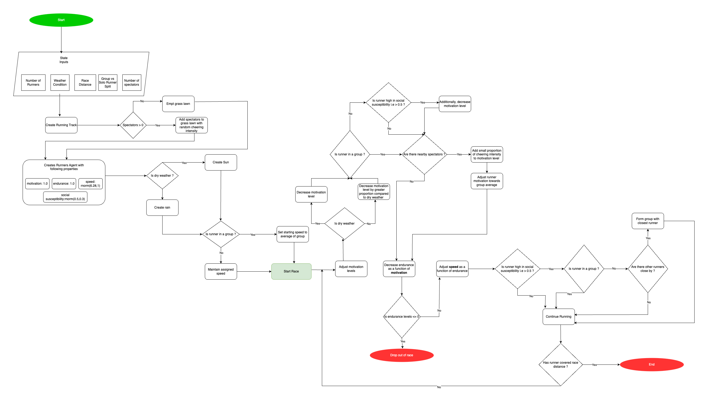

# Road Running: Social Influence and Group Dynamics

## What is it ?

This simulation study is designed to investigate the impact of various social dynamics on the performance of non-professional runners during road running events. Specifically, it seeks to compare the effectiveness of group running versus solo running under the influences of several key factors: race distance, weather conditions, the presence of external spectators, and the individual social inclinations of the runners. The research aims to assess how these factors affect the performance differences between group and solo runners and to explore the sustainability of running groups under varying conditions.

## Model

